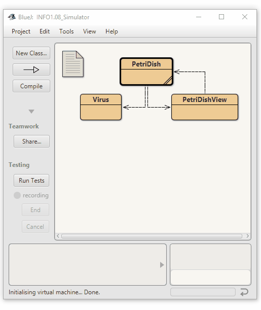

An implementation of the 2D cellular automaton known as Brian's Brain.
See https://en.wikipedia.org/wiki/Brian%27s_Brain

But instead it's Conway's Game Of Life.
And supposedly a lost Corona Puzzle.

Based on the original by David J. Barnes and Michael Kölling

@author n-c0de-r

@version 03.09.21

