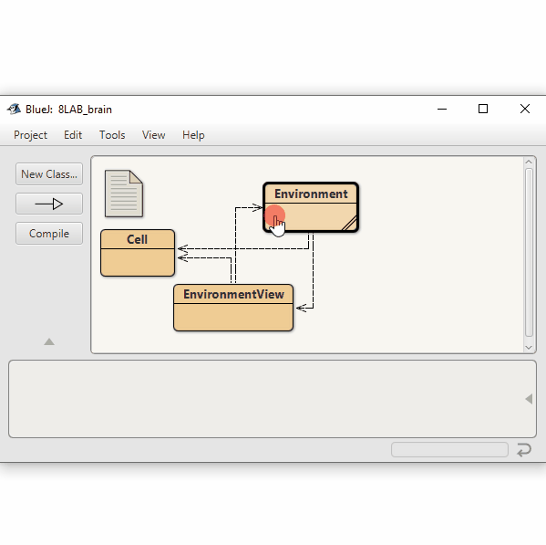

# Lab1.8
Conway's Game of Life, 1st semester, 8th exercise, computer science.

Project: brain
Aothors: David J. Barnes and Michael Kölling

This project is part of the material of the book

   Objects First with Java - A Practical Introduction using BlueJ
   Sixth edition
   David J. Barnes and Michael Kölling
   Pearson Education, 2016

It is discussed in chapter 7.

An implementation of the 2D cellular automaton known as Brian's Brain.
See https://en.wikipedia.org/wiki/Brian%27s_Brain

